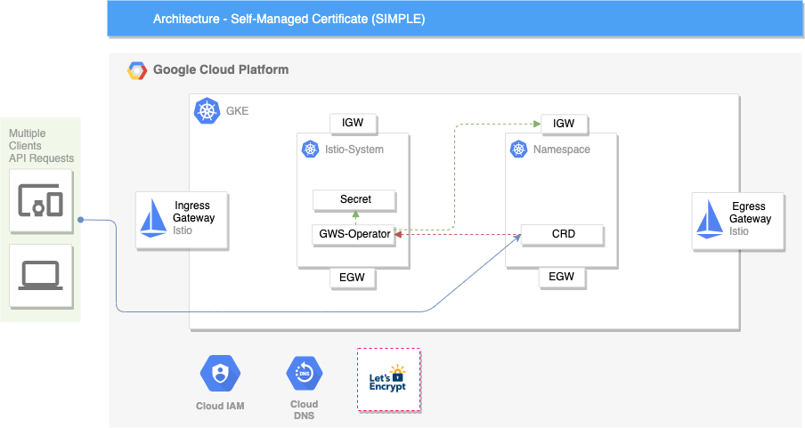
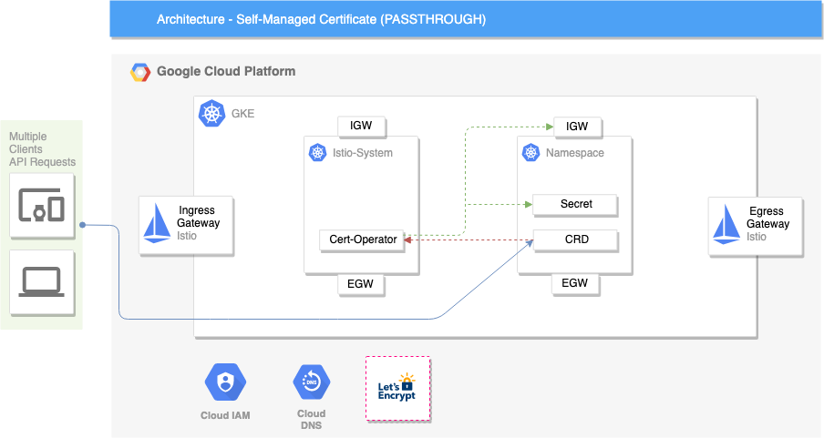

# Gateway Service Operator

This project creates a custom Kubertenes controller to automate the process of updating the Istio Gateway resource.

## Introduction

The Gateway Servive Operator protects your Istio Gateway object from changes that could potentially break Ingres/Egress within a Kubernetes cluster, teams can utalise the CRD that defines a server block definition within the Gateway object. It supports most of the key Istio functionality and adds additional validation and automation.

Segregation of duties is critical when provisioning Istio in a Kubernetes cluster - The Gateway object should be managed by the same team that is responsible for Istio in the cluster, however, to ensure engineers are able to continue to acheive without breaking their workflow this operator provides them with a secure way to update the Gateway object without directly mutating the resource.

## Example CRD

The following is an example of how to structure the required CRD.

```yaml
apiVersion: app.example.com/v1alpha1
kind: GatewayService
metadata:
  name: example-gateway-service
  namespace: default
spec:
  hosts:
    - "*.example.com"
  port: 443
  protocol: HTTPS
  mode: SIMPLE
  trafficType: ingress
  tlsOptions: {}
```

### Hosts

A list of hosts exposed by this gateway service. Standard DNS wildcard prefix syntax is permitted, however, wildcard prefix should be used with caution with a multi-tenancy cluster.

Note: A VirtualService that is bound to a gateway must having a matching host in its default destination. Specifically one of the VirtualService destination hosts is a strict suffix of a gateway host or a gateway host is a suffix of one of the VirtualService hosts.

### Port

The Port on which should be used to listen for incoming connections.

Note: The `name` field in the Gateway server block sued the following convention: `"<protocol-name-namespace>"`

*Example*:

```yaml
port:
  name: http-example-default
  number: 80
  protocol: HTTP
```

### Protocol

The following protocols are supported and can be specified: `HTTP`, `HTTPS`, `GRPC`, `HTTP2`. `MONGO` and `TCP`.

### Mode

The following modes are supported and can be specified: `SIMPLE`, `PASSTHROUGH` and `MUTUAL`.

### TrafficType

The following modes are supported and can be specified: `INGRESS` and `EGRESS`.

### TLSOptions

TLSOptions that are currently supported are `TLSSecret`, `TLSSecretRef` and `TLSSecretPath`. Please ensure you understand these options so that you choose the method best suited for your situation.

#### TLSSecret

If the TLSSecret option is specified it is implying that the `CredentialName` field in the Gateway is going to use the secrets explicitly provided by the CRD. When TLSSecret is being used you **MUST** provide the certificate and key that will be used for TLS termination, these secrets must be in base64 format (In future these values will be required to be encrpyed).

This method uses the provided secrets and will create a Kubernetes tls secret resource with those explicit values. The Mode will impact which namespace the tls secret is created within. If the `SIMPLE` mode is specified the tls termination occurs at the Gateway resource, which will be the Ingress/Egress gateway pod running, therefore the tls secret will be created in the namespace where these pods are currently running (usually in istio-system namespace). However, if the `PASSTHROUGH` mode is specified the tls termination occurs at the Pod resource, therefore the tls secret will be created in the namespace that the Pod resource is being executed.

#### TLSSecretRef

If the TLSSecretRef option is specified it is implied that the tls secret already exists in the namespace the Ingress/Egress pods are running within.

The tls secret object being referenced **MUST** exist otherwise the CRD will be rejected and the server block will not be added to the Gateway object. The rationale behind this behaviour is because even if a single reference to a tls secret that does not exist is intantiated in the Gateway object it will cause your Ingress/Egress to not work within the entire cluster.

Note: This option only supports using the `SIMPLE` mode.

#### TLSSecretPath

If the TLSSecretRef option is specified it is implied that the Ingress/Egress Pod will mount the tls secret within the Pod and you're referencing a tls secret that already exists. This method might be used if SDS is not available due to using Kubernetes <1.13.0.

However, if SDS is available within your Kubernetes cluster this method is **not** recommended.

Using TLSSecretPath also requires that the Pods deployment is updated to mount the tls secret into the Pod.

## Example Architecture

The following diagrams will demonstrate both `SIMPLE` and `PASSTHROUGH` architecture.

### SIMPLE Mode



### PASSTHROUGH Mode



## Local Setup

The following steps will assume you have a Kubernetes cluster available and are leveraging Istio as a service mesh.

Build the gatewayservice-operator Docker image

```bash
operator-sdk build xunholy/k8s-operator:latest
```

Push the gatewayservice-operator Docker image to a registry

```bash
docker push xunholy/k8s-operator:latest
```

Update the [operator.yaml](gatewayservice-operator/deploy/operator.yaml) manifest to use the built image name.

Deploy CRDs to a Kubernetes cluster to extend the API server and create the required objects

```bash
kubectl apply -f deploy/ -R -n istio-system
```

Note: This will also deploy a example GatewayService CRD into the Kubernetes cluster. View the file [HERE](gatewayservice-operator/deploy/crds/app_v1alpha1_gatewayservice_cr.yaml)

Verify the gatewayservice operator is running

```bash
kubectl get pod -l name=gatewayservice-operator
```

**Congratulations**! You will now have the gatewayservice operator up and running locally.

## Generating Project

Generate default operator project.

```bash
operator-sdk new gatewayservice-operator --repo github.com/xUnholy/k8s-operator
```

Add a new API for the custom resource

```bash
 operator-sdk add api --api-version=app.example.com/v1alpha1 --kind=GatewayService
```

Add a new controller that watches for GatewayService

```bash
operator-sdk add controller --api-version=app.example.com/v1alpha1 --kind=GatewayService
```
